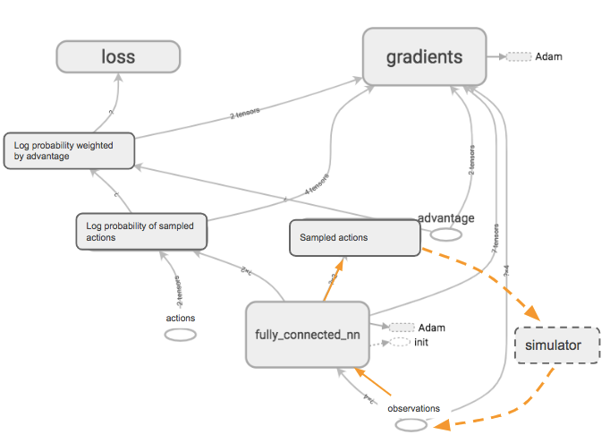
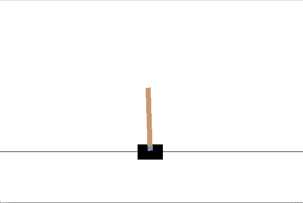

# Reinforcement Learning Projects
This is my solution (WIP) to Berkley's Deep Reinforcement Learning Class CS294-112 in Fall 2018. It consists of five projects, each of which is an implementation of a reinforcement learning algorithm. I am continuously updating this repository as I go along the course. Below are the highlights of the results:

## hw1: Behavorial Cloning
In this project, I implemented the vanilla behaviorial cloning along with the DAgger variant to succesfully train a few MuJoCo tasks. Example:

## hw2: Policy Gradient
In this project, I implemented policy gradient algorithm and qualitatively compared four variants of it: adding reward to go (reward to go), normalize the reward (normalization), subtracting the reward by a simple baseline of the average (baseline) and a baseline that is predicted by a neural network (baseline_nn). 

Computation graph:

Learned task: Cart Pole

## hw3
In this project, I implemented Q learning and compared two variants of it: with and without double Q learning.

Pong learned with Q learning (green is the trained agent):

## hw4
Coming soon

## hw5
Coming soon

* Note: These are partial solutions. I didn't post results for some problems, such as hyper parameter tuning reports.
