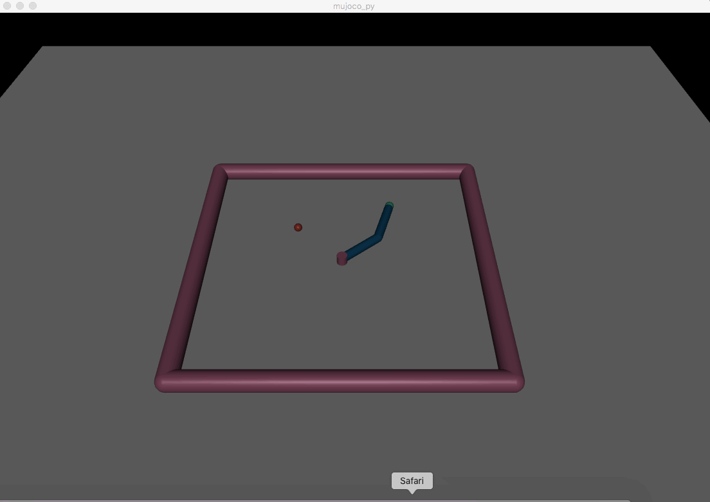

# CS294-112 HW 1: Imitation Learning

## Background
This is the writeup of my solutions Berkeley CS294 Deep Reinforcement Learning (Fall 2018) Homework 1. In this project, I used imitation learning along with the DAgger algoirthm to solve a few MuJoCo tasks, for example, to have an agent walk like a humen or a robot armt to reach for a certain target.

### Understand the Original Codebase
The given instruction (see hw1.pdf) omits many details. Here I will provide a more detailed walkthrough.

To start off, we are provided with a few trained expert policies. The trained models, namely the experts, can successfully execute all these tasks; our goal is to treat these as the golden standard and learn after the experts. Their model parameters (weights, biases, activation functions for a feed forward neural network) are saved as pickle files in `experts/` directory.

See demo gif of executing the humanoid task with the expert policy (one rollout, played on repeat):


To load the demo yourself, download all the dependencies, make a directory named "expert_data", and run `bash demo.bash` (change `python` to `python3` if python3 is not your default python option). The default camera angle does not show much happenings. Press `tab` key once to switch for a better camera angle in the simulator. Also, lower the simulation speed with `s` key if necessary. 

We aren't told how and on what data the models are trained. But we can build an understanding of its archetecture from reading `load_policy.py`: you can see that they use fully-connected feed-forward neural networks. You can further see the dimension of each neural network by loading the pickle files. For example for the humanoid task:

```
>>> import pickle

>>> filename = 'experts/humanoid-v2.pkl'
>>> with open(filename, 'rb') as f:
        data = pickle.loads(f.read())
>>> data['GaussianPolicy']['hidden']['FeedforwardNet'].keys()
dict_keys(['layer_2', 'layer_0'])
>>> len(data['GaussianPolicy']['hidden']['FeedforwardNet']['layer_0']['AffineLayer']['W'])
376
>>> len(data['GaussianPolicy']['hidden']['FeedforwardNet']['layer_2']['AffineLayer']['W'])
64
>>> len(data['GaussianPolicy']['out']['AffineLayer']['W'])
64
``` 

It has two hidden layers, each of dimension 64.

The `run_expert.py` script loads the environment and the expert policy and saves the observations and actions during the runs in a file which will later become training data for our imitation learning. Each run is called a rollout. While the policy is deterministic, the environment is not, and thus having multiple rollouts will gives us more training data to reduce the variance of our model.

## My Solution
### Behaviorial Cloning
The naive behaviorial cloning is a supervised learning problem. We run the expert policy a number of times and these observation and action pairs become our labelled training data.

I used a neural network to accomplish the supervised learning. For a fair comparison, I mimiced the network achitecture of the expert models: two hidden layers, each of dimension 64, with tanh as the activaiton function. See implementation of `train_imitation.py`.

Simple behaviorial cloning get us comparable performance to the expert policy in the Reacher task, likely because the input and output space are low dimensional. Also, unlike other tasks where the humanoid or half cheetah can fall down and never get back up, there is not a sense of "absolute failure" in this task: the arm won't be stuck in an unrecoverable state.

See the Reacher learned from imitation:



In contrast, in the Humanoid task, behavior cloning does not get us very far -- as you can see in the gif below, it falls over after two or three baby steps. It is also a higher-dimensional and much harder problem:


### DAgger
The problem of naive behavior cloning is that once the agent makes a small mistake in the beginning stages, it steps into a new observation space that is not seen in the training data. From there, the agent does not know how to recover. What the DAgger algorithm does is that after we train a few epochs, we run our half-learned policy on the agent. We save those observations, and ask the expert policy to evaluate what action it would take if given such observations. We append the new data points to the training dataset and iterate. See implementation in `train_imitation.py:prepare_dagger_data()` and `run_imitation.py`.

With DAgger, the humanoid can run a couple more steps than what we saw from before without falling, but is still far from comparable to expert policy.


More qualitative evaluation is logged in `log.txt`.

### Example usage
After implementation Here are the example commands:

Problem 2.1
To generate rollouts and save training data:
```
python3 run_expert.py experts/Reacher-v2.pkl Reacher-v2 --num_rollouts=1000 --save
```

To train the imitation learning model:
```
python3 train_imitation.py Reacher-v2-1000rollouts.pkl --epoch 200 --save
```

Problem 2.2
To run the trained imitation learning model and get the reported mean and standard deviation of return:
```
python3 run_imitation.py Reacher-v2-1000rollouts-epoch200.ckpt
```

Add `--render` to view the agent in action in the simulator.

Problem 3.1
To train the imitation learning model with DAgger:
```
python3 train_imitation.py Reacher-v2-100rollouts.pkl --dagger --expert_policy_file experts/Reacher-v2.pkl\
    --epoch 30 --dagger_iterations 30 --dagger_num_rollouts 100 --save
```

Problem 3.2
To run the DAgger model and report stats, command is same as in 2.2:
```
python3 run_imitation.py Reacher-v2-100rollouts-dagger-30iter-100dagger_rollouts-epoch30.ckpt --num_rollouts=1000
```

### File Structure
`experts` directory comes with the original repository. Each pickle file in it stores the parameters for the neural networks used in the expert policies.

`expert_data` directory stores the rollouts of the expert policy. Each pickle file stores a series of observations and actions for a given task.

`saved_models` directory stores the tensorflow checkpoints of my models trained with imitation learning (and some with DAgger). To load the policy we learned, we load these checkpoints in tensorflow and do inference.


## Dependencies
 * Python **3.5**
 * Numpy version **1.14.5**
 * TensorFlow version **1.10.5**
 * MuJoCo version **1.50** and mujoco-py **1.50.1.56**
 * OpenAI Gym version **0.10.5**

Once Python **3.5** is installed, you can install the remaining dependencies using `pip install -r requirements.txt`.

**Note**: MuJoCo versions until 1.5 do not support NVMe disks therefore won't be compatible with recent Mac machines.
There is a request for OpenAI to support it that can be followed [here](https://github.com/openai/gym/issues/638).
