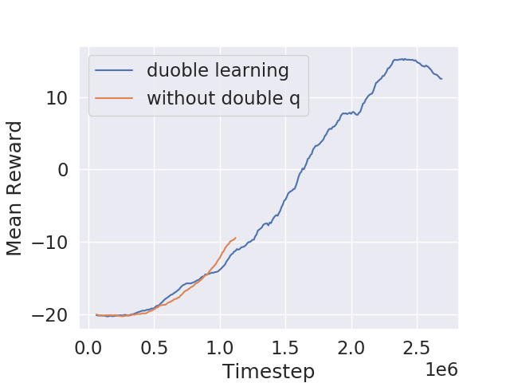
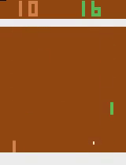
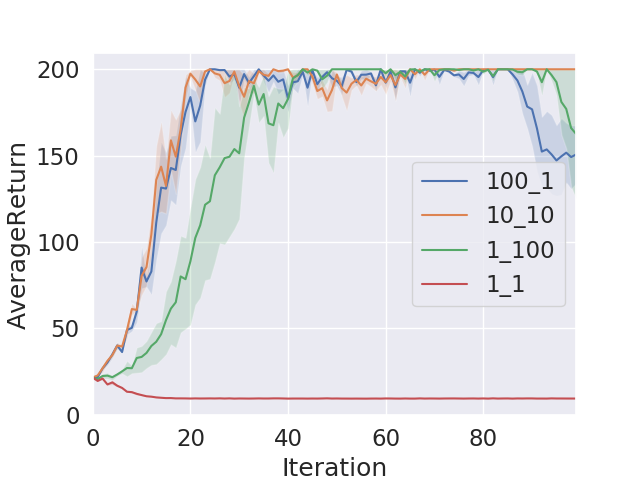
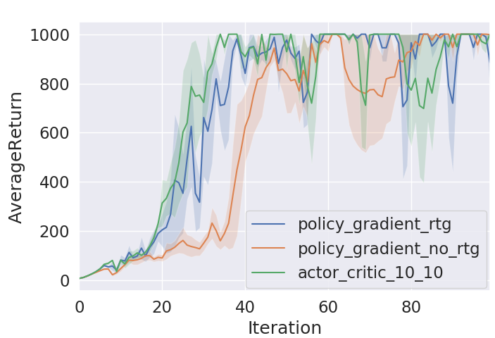
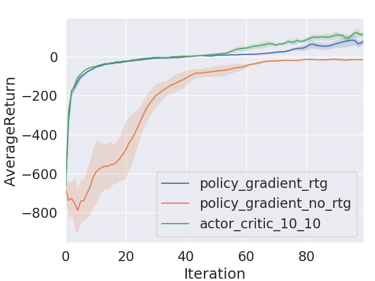

# CS294-112 HW 3: Q-Learning

## Q learning
In this project, I implemented Q learning (dqn.py) and compared two variants of it: with and without double Q learning.



Oddly, the double-q results are worse.(Thanks DanielTakeshi[https://github.com/DanielTakeshi] for pointing out a bug! After fixing the bug, it got better, but I haven't got the full results to post here.)

Here is a qualitative result of the Pong game learned with Q learning at peak performance (green is the trained agent):



## Actor-Critic

For the second part of the project, I implemented the actor-critic algorithm (train_ac_f18.py). 

Here are the cartpole training results with different hyperparameters. To read the legend, the first number denotes the number of times we update the target network per training cycle (hereafter referred to as ntu), and the second number denotes the number of times we take the gradient step to update the critic network for each target network udpate (hereafter referred to as ngsptu). A setting of ntu = 10 and ngsptu = 10 achieves the best result.



```
python train_ac_f18.py CartPole-v0 -n 100 -b 1000 -e 3 --exp_name 1_1 -ntu 1 -ngsptu 1
python train_ac_f18.py CartPole-v0 -n 100 -b 1000 -e 3 --exp_name 100_1 -ntu 100 -ngsptu 1
python train_ac_f18.py CartPole-v0 -n 100 -b 1000 -e 3 --exp_name 1_100 -ntu 1 -ngsptu 100
python train_ac_f18.py CartPole-v0 -n 100 -b 1000 -e 3 --exp_name 10_10 -ntu 10 -ngsptu 10
```



As shown, the actor critic is slightly better than policy gradient (with reward to go) under the same parameter setting.

```
# policy gradient without reward-to-go
~/hw2: python train_pg_f18.py InvertedPendulum-v2 -ep 1000 --discount 0.9 -n 100 -e 3 -l 2 -s 64 -b  5000 -lr 0.01 --exp_name ip_b5000_lr0.01
# policy gradient with reward-to-go
~/hw2: python train_pg_f18.py InvertedPendulum-v2 -ep 1000 --discount 0.95 -n 100 -e 3 -l 2 -s 64 -b  5000 -lr 0.01 -rtg --exp_name ip_b5000_lr0.01_rtg
# actor critics
~/hw3: python train_ac_f18.py InvertedPendulum-v2 -ep 1000 --discount  0.95 -n 100 -e 3 -l 2 -s 64 -b 5000 -lr 0.01 --exp_name 10_10 -ntu 10 -ngsptu 10
```

I also did the comparision for the half cheetah task, and the comparison in results is similar.



```
# policy gradient without reward-to-go
~/hw2: python train_pg_f18.py HalfCheetah-v2 -ep 150 --discount 0.9 -n 100 -e 3 -l 2 -s 32 -b 30000 -lr 0.02 --exp_name hc_b30000_r0.02
# policy gradient with reward-to-go
~/hw2: python train_pg_f18.py HalfCheetah-v2 -ep 150 --discount 0.9 -n 100 -e 3 -l 2 -s 32 -b 30000 -lr 0.02 -rtg --exp_name hc_b30000_r0.02
# actor critics
~/hw3: python train_ac_f18.py HalfCheetah-v2 -ep 150 --discount 0.9 -n 100 -e 3 -l 2 -s 32 -b 30000 -lr 0.02 --exp_name 10_10  -ntu 10 -ngsptu 10
```

## Dependencies:
 * Python **3.5**
 * Numpy version **1.14.5**
 * TensorFlow version **1.10.5**
 * MuJoCo version **1.50** and mujoco-py **1.50.1.56**
 * OpenAI Gym version **0.10.5**
 * seaborn
 * Box2D==**2.3.2**
 * OpenCV
 * ffmpeg

Before doing anything, first replace `gym/envs/box2d/lunar_lander.py` with the provided `lunar_lander.py` file.

The only files that you need to look at are `dqn.py` and `train_ac_f18.py`, which you will implement.

See the [HW3 PDF](http://rail.eecs.berkeley.edu/deeprlcourse/static/homeworks/hw3.pdf) for further instructions.

The starter code was based on an implementation of Q-learning for Atari generously provided by Szymon Sidor from OpenAI.
