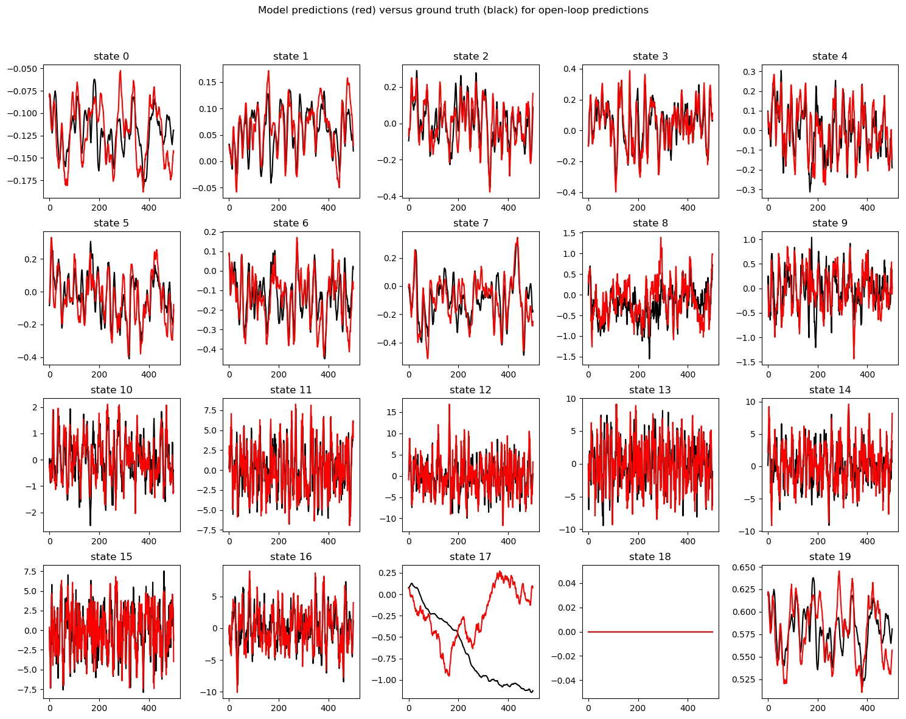
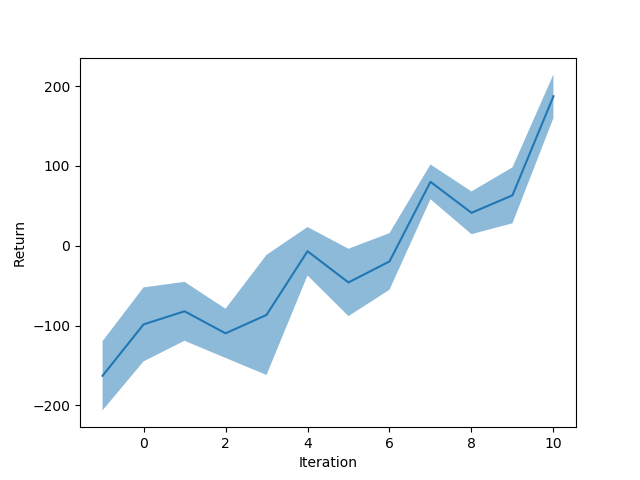

In this project, we implemented model-based reforcement learning.

Problem 1:

Here we gathered 10 rollouts on the half-cheetah task using a random policy and trained a one-layer neural network to predict the next state given the current state and the action. After 60 training epochs, the model does reasonably well as shown in the plot below. Here we do open-loop prediction: the input is only the first state, and the whole sequence of actions, and we predict the sequence of subsequent states. The prediction for observational state dimension 17 has consitently low accuracy for some reason.



Problem 2:

Next we build a first version of a policy exploiting the learned model. Here, we randomly draw 4096 sequences of actions from all possible combinations over a finite horizon (15). Using the MPC model, we pick the sequence with the lowest cost, and execute only the first action. We repeat the process to select the next option.

The training process is ~20 min on my 8GB Macbook Air with Core i5. The output varies across the runs, but on average, I didn't observe substantial improvement from the random baseline (see below), far from the expected return of 0 as claimed in the problem set instruction.

```
Random policy
---------  ---------
ReturnAvg  -142.612
ReturnMax  -105.345
ReturnMin  -213.294
ReturnStd    30.5591
---------  ---------

Trained policy
-----------------  -------------
ReturnAvg          -138.456
ReturnMax          -108.594
ReturnMin          -177.594
ReturnStd            23.0199
TrainingLossFinal     0.00683294
TrainingLossStart     2.63199
-----------------  -------------
```

Problem 3:

Improving upon the previous result, we now use an on-policy rollout. For each iteration in the 10 iterations, we train the policy, and gather another rollout using the latest policy, and add it to the existing dataset to be used for training in the next iteration.

Results here are substantially better, and steadily improve over iterations. At the end of the 10 iterations, it achieves an average return of 187 (though lower than the result of 300 as claimed by the problem set instruction). Notably, this is much better than the best results we have achieved in the half cheetah task using policy gradient or actor-critics (which hovers around 0).


