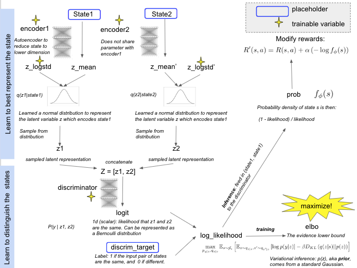
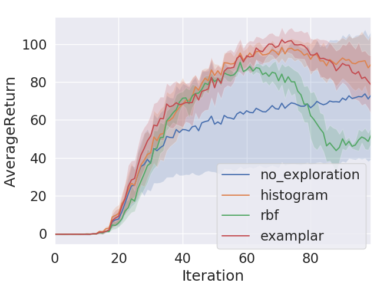
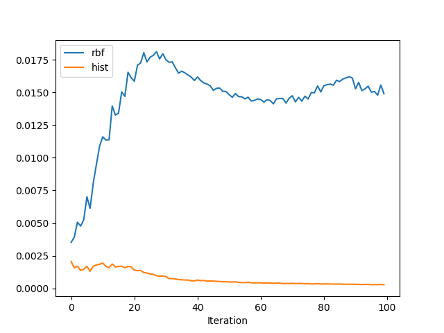
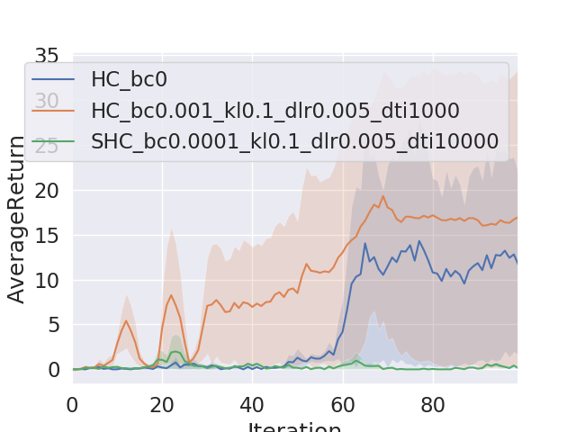
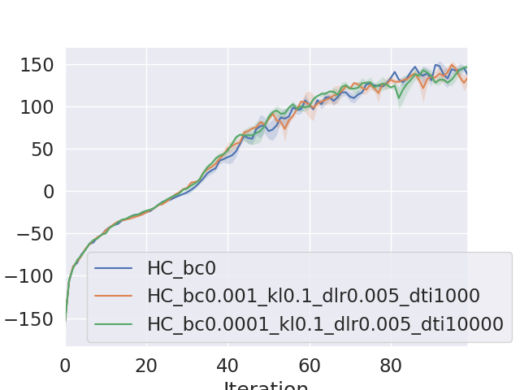

# CS294-112 HW 5a: Exploration
## Overview
In this project, I applied exploration in actor-critics training. This type of exploration is useful for environments where the reward is sparse. Specifically, we calculate a bonus for each state based on how frequent we have visited the state before, and add the bonus to the reward function to encourage the agent to explore rarely-seen states. I calcuate the bonus in three ways.

a) Histogram Model: bin states into discrete cases and simply counting each time a state is seen, N(s). The bonus is then N(s) ^-1/2 
b) Kernel Density Estimate (RBF): estimate the density of a new datapoint by plopping a Gaussian distribution centered around each of the existing datapoints
c) Examplar: train a state-conditioned noisy discriminator (https://arxiv.org/abs/1703.01260)

## Method
Here is a schema for the examplar implementation:



## Results
We first tested our results in a PointMass environment. The agent starts off at coordinate (2, 2) in a grid world and the goal is to reach (18, 18). The reward is extremely sparse, which makes it a suitable setup for using exploration: you only get a reward for reaching the goal and 0 otherwise. Here is the visualization of the trained agent:

No exploration:


Exploration using histogram:


As shown, when not using exploration, the agent does not branch out to try different states as often, and therefore has a small chance of hitting the goal state. When using exploration, once the agent hits the goal state and gets the reward, it learns to go straight to that state.

Comprison for PointMass environment:



```
# no exploration
python train_ac_exploration_f18.py PointMass-v0 -n 100 -b 1000 -e 3 --density_model none -s 8 --exp_name PM_bc0_s8
# histogram
python train_ac_exploration_f18.py PointMass-v0 -n 100 -b 1000 -e 3 --density_model hist -bc 0.01 -s 8 --exp_name PM_hist_bc0.01_s8
# rbf
python train_ac_exploration_f18.py PointMass-v0 -n 100 -b 1000 -e 3 --density_model rbf -bc 0.01 -s 8 -sig 0.2 --exp_name PM_rbf_bc0.01_s8_sig0.2
# examplar
python train_ac_exploration_f18.py PointMass-v0 -n 100 -b 1000 -e 3 --density_model ex2 -s 8 -bc 0.05 -kl 0.1 -dlr 0.001 -dh 8 -dti 1000 --exp_name PM_ex2_s8_bc0.05_kl0.1_dlr0.001_dh8_dti1000
```

As you can see, histogram and examplar achieve the best results. It is not surprising for histogram to achieve the best result here because the state space is small and discretization is doable; in such case, histogram provides the most accurate measure of the density model whereas the other methods are all estimates. Interestingly though, RBF starts off better than no-exploration but falls off later. My guess is that unlike histogram, the bonus in RBF is inversely proportional to the probability density of the state instead of the raw count; therefore it does not diminish over time. Even after it has explored enough, it keeps exploring instead of exploiting. You can see a comparison in the magnitude of the bonus in the plot below:



We then tested the hyperparameters of examplar on a more complicated task: sparse-half-cheetah. It is the same environment as half-cheetah, expect that the reward is very sparse.



The orange line is examplar with an bonus coefficient of 0.001; this is shown to perform the best. The blue line is no exploration. The green like is examplar with a bonus coefficient of 0.0001. It is performing worse than no exploration at all, possibly because there is considrerable varaibiltiy between runs (the standard deviation of the blue line is very large; only one out of the three seeds I tried learned something). This is different the expectation set in the homework instruction.

```
python train_ac_exploration_f18.py sparse_half_cheetah -ep 150 --discount 0.9 -n 100 -e 3 -l 2 -s 32 -b 30000 -lr 0.02 --density_model none --exp_name SHC_bc0
python train_ac_exploration_f18.py sparse_half_cheetah -ep 150 --discount 0.9 -n 100 -e 3 -l 2 -s 32 -b 30000 -lr 0.02 --density_model ex2 -bc 0.001 -kl 0.1 -dlr 0.005 -dti 1000 --exp_name SHC_bc0.001_kl0.1_dlr0.005_dti1000
python train_ac_exploration_f18.py sparse_half_cheetah -ep 150 --discount 0.9 -n 100 -e 3 -l 2 -s 32 -b 30000 -lr 0.02 --density_model ex2 -bc 0.0001 -kl 0.1 -dlr 0.005 -dti 10000 --exp_name SHC_bc0.0001_kl0.1_dlr0.005_dti10000
```

Lastly, out of curiosity, I also tried running on the regular half-cheetah task, where the reward is not sparse. 



Here we don't see difference in performance with or without exploration. This illustrates the point that exploration is most useful in MDPs with sparse reward.

```
python train_ac_exploration_f18.py Half-Cheetah-v2 -ep 150 --discount 0.9 -n 100 -e 3 -l 2 -s 32 -b 30000 -lr 0.02 --density_model none --exp_name SHC_bc0
python train_ac_exploration_f18.py Half-Cheetah-v2 -ep 150 --discount 0.9 -n 100 -e 3 -l 2 -s 32 -b 30000 -lr 0.02 --density_model ex2 -bc 0.001 -kl 0.1 -dlr 0.005 -dti 1000 --exp_name SHC_bc0.001_kl0.1_dlr0.005_dti1000
python train_ac_exploration_f18.py Half-Cheetah-v2 -ep 150 --discount 0.9 -n 100 -e 3 -l 2 -s 32 -b 30000 -lr 0.02 --density_model ex2 -bc 0.0001 -kl 0.1 -dlr 0.005 -dti 10000 --exp_name SHC_bc0.0001_kl0.1_dlr0.005_dti10000

```

## Dependencies:
 * Python **3.5**
 * Numpy version **1.14.5**
 * TensorFlow version **1.10.5**
 * MuJoCo version **1.50** and mujoco-py **1.50.1.56**
 * seaborn
 * tqdm==**4.26.0**

Before doing anything, first replace `gym/envs/mujoco/half_cheetah.py` with the provided `sparse_half_cheetah.py` file. It is always a good idea to keep a copy of the original `gym/envs/mujoco/half_cheetah.py` just in case you need it for something else.

See the hw5a.pdf in this folder for further instructions.
<!--See the [HW5 PDF](http://rail.eecs.berkeley.edu/deeprlcourse/static/homeworks/hw5a.pdf) for further instructions-->.
